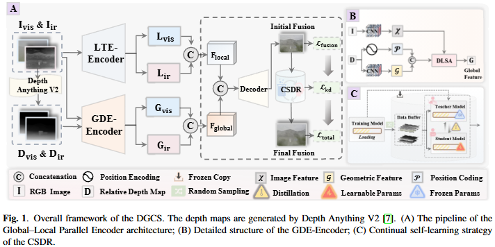

# DGCS: Depth-Guided Continual Self-learning for Infrared and Visible Image Fusion [ICASSP 2026] 

Yuang Zhang1 &ensp; Wenkai Wang1 &ensp; Ruhao Yan1 &ensp; Henglu Wei1 &ensp; Wei Zhong1 

1College of Information Science and Technology, Dalian Maritime University

## Updates
[2026-01-18] Our paper has been accepted by ICASSP 2026! All code and related model files will be published when we complete the sorting process. It won't take long.

